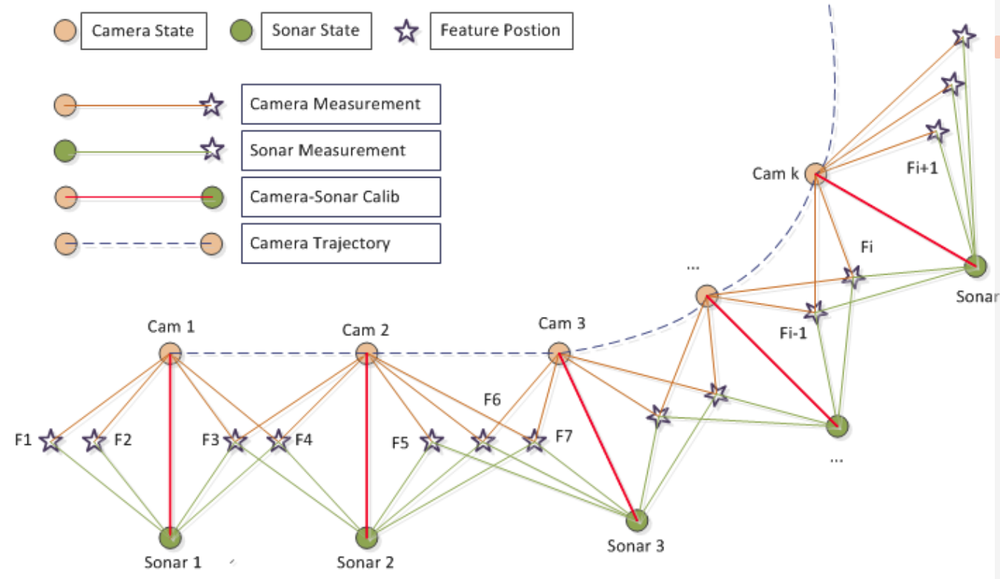

# Underwater Camera and Sonar SLAM

## Building

* Clone the repository
* Ensure dependencies are installed
* Create a build folder `mkdir build` and `cd build`
* Run cmake `cmake ..`
* Build it `make -j5`
* Run the program `./mast_project_synth`

## Dependencies

* Eigen3 - `sudo apt-get install libeigen3-dev`
* Eigen3 Unsupported - Included in the above
* OpenCV 3.0 - http://opencv.org/
    * Use OpenCV 3.0 not opencv 2.x
    * Ensure you install using `sudo make install`
    * Also install community contrib modules
* g2o solving framework - https://github.com/RainerKuemmerle/g2o
* SuiteParse - http://packages.ubuntu.com/source/precise/suitesparse

